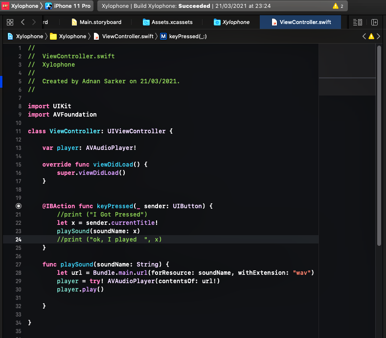
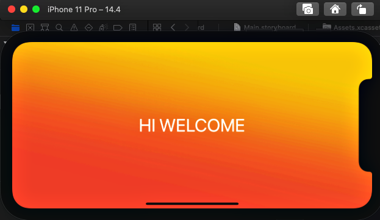
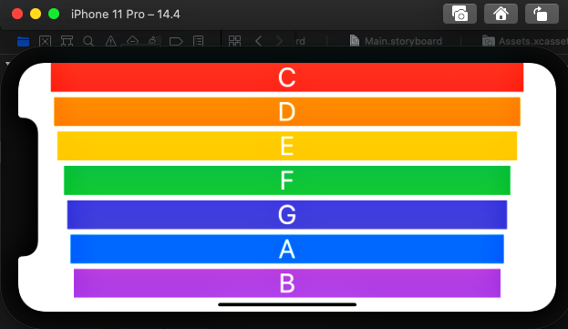
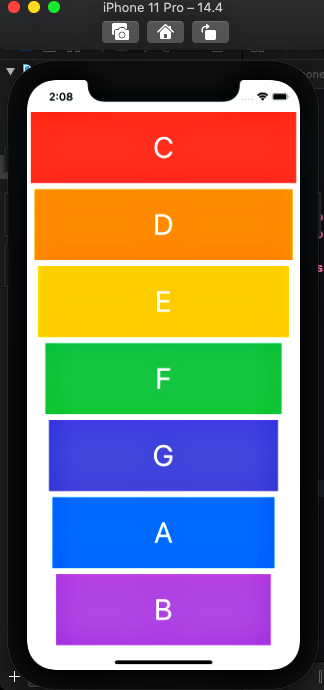

# Xylophone

## What I Made

Makes a first musical instrument app!  It's a colourful XyloPhone app, different button deliver a sound differntly and serve as a Nice Xylophone in phone!  

## What I learned for making this

* How to play sound using AVFoundation and AVAudioPlayer.
* Understand Apple documentation 
* Functions and methods in Swift. 
* Data types.
* Swift loops.
* Variable scope.
* The ViewController lifecycle.
* Error handling in Swift.
* Code refactoring.
* Basic debugging.

## ScreenShot

!

